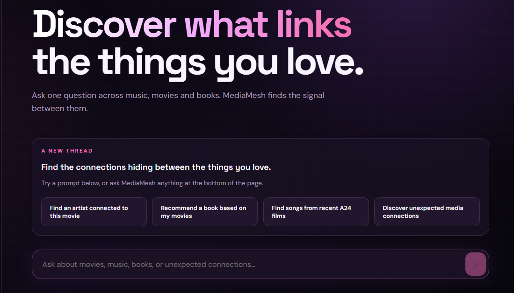

# MediaMesh

MediaMesh is a media intelligence application that combines a React frontend, a FastAPI backend, and an evidence-grounded Python agent. The agent searches live movie, music, and book data through Model Context Protocol (MCP) servers and uses Google Gemini to produce answers based on the returned evidence.



The interface lets users ask one question across music, movies, and books to discover connections between them.

## Features

- Search TMDB for movies, production companies, cast, and crew.
- Search MusicBrainz for artists, recordings, releases, and relationships.
- Search Google Books for books and bibliographic metadata.
- Generate grounded answers with LangChain and Google Gemini.
- Store user-scoped conversations, messages, authentication, and long-term memories in Supabase PostgreSQL.
- Authenticate users through the FastAPI backend with HTTP-only session cookies.
- Use the React application or the included Streamlit interface.

## Architecture

```text
React frontend
       |
       v
FastAPI backend
       |
       v
MediaMesh agent and services
       |
       +--> Gemini LLM
       +--> MCP client
              |
              +--> TMDB MCP server
              +--> MusicBrainz MCP server
              +--> Google Books MCP server
```

The agent is instructed to use structured MCP evidence and to identify information that cannot be verified from the available sources.

## Project Structure

```text
MediaMesh/
├── backend/
│   ├── api/            # FastAPI routes
│   ├── agent/          # Agent, LLM, and MCP client logic
│   ├── data/           # Local application data
│   ├── graph/          # Graph-related backend modules
│   ├── mcp_servers/    # TMDB, MusicBrainz, and Google Books servers
│   ├── memory/         # Chat history storage
│   ├── models/         # Backend models
│   ├── services/       # Authentication and chat services
│   ├── streamlit/      # Streamlit interface
│   ├── utils/          # Configuration helpers
│   ├── main.py         # FastAPI entrypoint
│   └── requirements.txt
├── frontend/           # React and Vite application
├── tests/              # Python test suite
├── .env.example        # Environment variable template
└── README.md
```

## Requirements

- Python 3.11 or newer
- Node.js and npm
- A TMDB API key
- A Google Gemini API key
- MusicBrainz access does not require an API key
- Google Books can be used without a key; an optional API key is supported

## Installation

From the repository root on Windows:

```powershell
py -3.11 -m venv .venv
.\.venv\Scripts\Activate.ps1
python -m pip install --upgrade pip
python -m pip install -r backend/requirements.txt
Copy-Item .env.example .env
```

On macOS or Linux:

```bash
python3 -m venv .venv
source .venv/bin/activate
python -m pip install --upgrade pip
python -m pip install -r backend/requirements.txt
cp .env.example .env
```

Add the required credentials to `.env` before starting the application.

## Environment Variables

```text
TMDB_API_KEY=your_tmdb_key
GOOGLE_API_KEY=your_gemini_key
GEMINI_API_KEY=your_gemini_key
GEMINI_MODEL=gemini-3.5-flash-lite
GOOGLE_BOOKS_API_KEY=optional_google_books_key
DATABASE_URL=postgresql+psycopg://postgres.<project-ref>:<password>@<supabase-host>:5432/postgres
```

`GOOGLE_API_KEY` or `GEMINI_API_KEY` is used for Gemini. `DATABASE_URL` is server-side only and must use the `postgresql+psycopg://` scheme. Never put it in frontend environment files.

## Supabase Database Setup

1. Create a Supabase project and copy its PostgreSQL connection string.
2. Set `DATABASE_URL` in the root `.env`; keep the password out of source control.
3. Install backend dependencies, then create the schema:

```powershell
python -m pip install -r backend/requirements.txt
alembic upgrade head
```

To preserve existing local data, run the importer after the schema migration. It reads `backend/data/mm.db` without deleting it:

```powershell
$env:MEDIAMESH_DB_PATH="backend/data/mm.db"
python scripts/migrate_sqlite_to_postgres.py
```

## Run The Application

### Start the FastAPI backend

From the repository root:

```powershell
cd backend
python -m uvicorn main:app --reload
```

The API runs at `http://localhost:8000`.

Health check:

```text
GET http://localhost:8000/api/health
```

### Start the React frontend

In a second terminal:

```powershell
cd frontend
npm install
npm run dev
```

The frontend uses `http://localhost:8000` as the default API URL. To use a different backend URL, create `frontend/.env.local` with:

```text
VITE_API_URL=http://localhost:8000
```

Do not put API keys or session tokens in frontend environment files.

### Start the Streamlit interface

The Streamlit interface is available at `backend/streamlit/app.py`:

```powershell
.\.venv\Scripts\streamlit.exe run backend/streamlit/app.py
```

It uses the same agent, memory, configuration, and MCP servers as the FastAPI application.

## MCP Servers

The MCP servers are normally started automatically by the MCP client. They can also be run individually for development:

```powershell
python -m backend.mcp_servers.tmdb_mcp
python -m backend.mcp_servers.musicbrainz_mcp
python -m backend.mcp_servers.books_mcp
```

These processes communicate over MCP stdio and are intended to be started by the application rather than used as HTTP services.

## Testing

Run the complete Python test suite from the repository root:

```powershell
python -m pytest -q
```

The tests cover the agent, LLM parsing, chat history, MCP clients, MCP tool discovery, and individual MCP integrations.

## API Overview

The FastAPI backend provides:

- `GET /api/health` - health check
- `POST /api/auth/signup` - create an account
- `POST /api/auth/login` - start a session
- `POST /api/auth/logout` - end a session
- `GET /api/auth/me` - get the current user
- `POST /api/chat` - send a chat message
- `GET /api/chat/history` - retrieve chat history
- `POST /api/chat/sessions` - create an empty conversation
- `GET /api/chat/sessions` - list the authenticated user's conversations
- `GET /api/chat/sessions/{session_id}` - retrieve one conversation's messages
- `DELETE /api/chat/history` - clear chat history

## Limitations

- Data freshness and rate limits depend on the upstream services.
- Gemini responses depend on the configured model, credentials, and available MCP evidence.
- The project is intended as a proof of concept rather than a production deployment.
